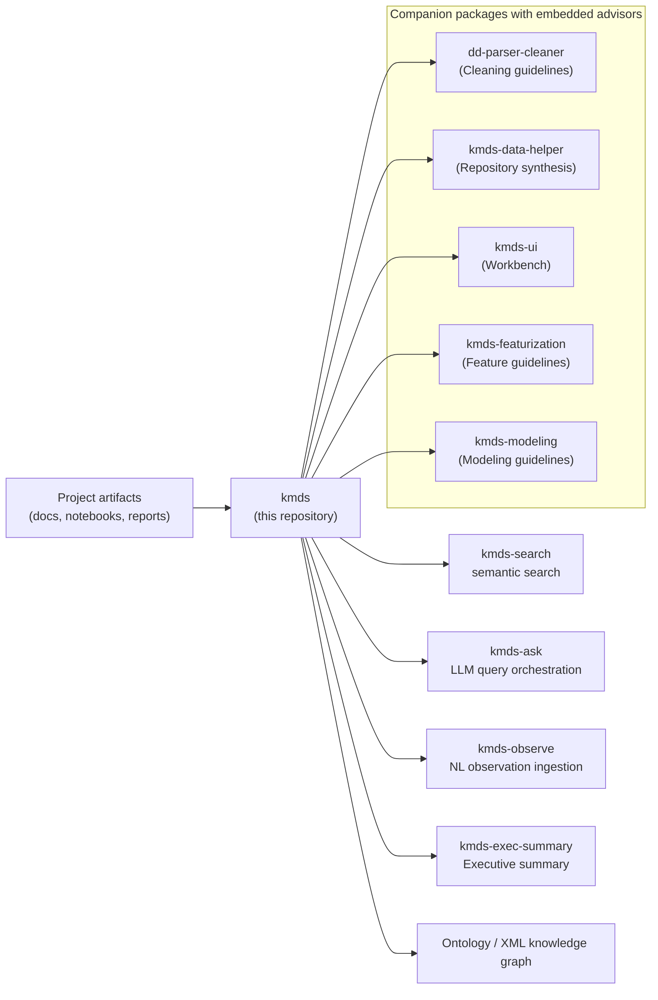

<p align="center">
  <a href="https://kmds.readthedocs.io/en/latest/">
    
  </a>
</p>
<h1 align="center">Knowledge Management for Data Science (KMDS)</h1>
<p align="center">
  <strong>Rigorous, repeatable operational analytics backed by evidence-based decision guidance at every phase.</strong>
</p>
<p align="center">
  <a href="https://zenodo.org/doi/10.5281/zenodo.10695270"></a>
  <a href="https://opensource.org/licenses/Apache-2.0"></a>
  <a href="https://kmds.readthedocs.io/en/latest/?badge=latest"></a>
</p>

## KMDS — Knowledge Management for Data Science

> KMDS is a complete methodology framework for building well-documented analytical and machine learning models for operational data. It combines decision guidance at every analytical phase—data cleaning, featurization, and modeling—with LLM-assisted knowledge capture and semantic search.

KMDS is grounded in a knowledge graph and now includes LLM-powered assistants. It is an agent-assisted, human-in-the-loop, collaborative knowledge management system. The grounding is based on curated knowledge for each phase of the development iteration.

Operational decisions — monthly forecasts, risk assessments, demand plans — need to be trustworthy, explainable, and repeatable. KMDS enforces the discipline that makes that possible through evidence-based guidance, structured documentation, and a knowledge graph that captures not just what was done, but *why it was done that way*. The result is reproducible, auditable, and transferable—your second project in a domain is faster because the first project's knowledge isn't lost.

---

## Who This Is For

KMDS is a productivity tool for **mid-level and above data scientists** working in small teams (2–10 people) on operational analytics problems.

It assumes you write design documents, document your modeling decisions, and comment your notebooks. If you do, KMDS makes that work searchable, auditable, and transferable. If you don't, start there first — garbage in, garbage out applies here as much as anywhere.

---

## The Problem It Solves

Small data science teams building operational models face two related challenges:

**1. Knowledge Loss**
The knowledge generated during development — why a feature was engineered a certain way, why one model was chosen over another, what the data quality issues were and how they were resolved — lives in Slack threads, people's heads, and uncommented notebooks. When team members rotate, when a model needs to be audited, or when a second interface is built on the same domain, that knowledge has to be reconstructed from scratch.

**2. Decision Inconsistency**
Without systematic guidance, the same analytical problems get solved differently each time. One modeler chooses K-Means for clustering because it's familiar; another spends weeks on DBSCAN without understanding the tradeoffs. Guidelines from research and practice go unused because they're dispersed across papers, blog posts, and senior practitioners' memories.

KMDS addresses both. It provides evidence-based decision guidance at the moment you need it—data cleaning, featurization, modeling—and captures that guidance and your decisions in a knowledge graph, making the entire analytical process queryable and repeatable.

---

## Architecture



In practice, `dd-parser-cleaner` is the first companion step for cleaning tabular data with embedded decision guidance; its output is then used by downstream companion packages such as `kmds-featurization` and `kmds-modeling`, each of which includes consolidated research and heuristics.

This repository implements the core `kmds` package, which provides:

- CLI entry points for project summary logging, executive summaries, semantic search, search orchestration, and natural-language observation ingestion
- Ontology-backed XML/OWL knowledge graph workflows
- Local semantic indexing using sentence-transformers
- Optional LLM routing via Google GenAI or a custom LLM backend

Broader KMDS ecosystem packages (`dd-parser-cleaner`, `kmds-data-helper`, `kmds-ui`, `kmds-featurization`, `kmds-modeling`) include the decision advisors—consolidated guidelines, research-backed heuristics, and best practices for each analytical phase. These are companion projects that plug into the core KMDS infrastructure.

### Components

Component
Role

`kmds`
Core KMDS package in this repository, providing CLI entry points and ontology-backed knowledge graph workflows

`dd-parser-cleaner`
Data cleaning with embedded guidelines for common data quality problems, validation approaches, and transformation strategies

`kmds-data-helper`
Automated repository scanning and ingestion of documentation into KMDS

`kmds-featurization`
Feature engineering with embedded guidelines for feature selection, derivation strategies, and validation

`kmds-modeling`
Model development with embedded guidelines for algorithm selection, validation approaches, and hyperparameter strategies across model families

`kmds-search`
Semantic search over the accumulated project knowledge graph

---

## Key Repo Functionality

This repository defines the following CLI entry points in `pyproject.toml`:

- `kmds-summary-log`
- `kmds-exec-summary`
- `kmds-search`
- `kmds-ask`
- `kmds-observe`

The core package also includes ontology loading, semantic index building, and natural-language observation mapping.

---

## Setup

Install the package locally from this repository:

```
pip install -e .
```

Or install from PyPI if available:

```
pip install kmds
```

To install companion KMDS ecosystem packages from PyPI:

```
pip install dd-parser-cleaner kmds-data-helper kmds-ui kmds-featurization kmds-modeling
```

This repository does not include UI workbench or repository-scanning companion packages such as `kmds-ui` or `kmds-data-helper`.

### Optional LLM Support

LLM-assisted search orchestration and executive summary generation require the optional `google-genai` dependency and a valid `GOOGLE_API_KEY` environment variable. The package also supports supplying a custom LLM callable programmatically.

---

## The Blueprint: How a KMDS Project Works

### Responsibilities

A KMDS engagement has three clear areas of responsibility:

**The Client / Domain Owner**

- Provides access to operational data
- Reviews and validates domain analysis documents
- Defines what a trustworthy, auditable result looks like for their business

**The Data Science Team**

- Authors design documents, data dictionaries, and cleaning reports
- Documents modeling decisions and rationale in notebooks
- Maintains the `documents/` directory as a first-class artifact
- Engages with KMDS advisors to make informed decisions at each analytical phase

**The Framework (KMDS)**

- Provides evidence-based decision guidance through embedded advisors in each analytical phase (cleaning, featurization, modeling)
- Ingests all documentation into a structured knowledge graph
- Preserves lineage across featurization and modeling phases
- Makes accumulated knowledge queryable and auditable at any point
- Enables the methodology to be repeatable and transferable across projects

### The `documents/` Directory

Every KMDS project has a consistent `documents/` structure regardless of domain:

```
project/
├── documents/
│   ├── domain_analysis.md        # Business problem, unit of analysis, success criteria
│   ├── data_dictionary.md        # Schema, field definitions, known quality issues
│   ├── cleaning_report.md        # What was found, what was done, what was deferred, and the advisor guidance applied
│   ├── feature_engineering.md    # Feature decisions, rationale, and advisor recommendations considered
│   └── modeling_report.md        # Model selection, validation approach, final rationale, and advisor guidance applied
├── notebooks/
└── data/
```

This consistency is intentional. A new team member, an auditor, or a returning developer can orient themselves in any KMDS project without a walkthrough.

---

## Worked Example: SBA Loan Default Prediction

### The Business Problem

The U.S. Small Business Administration (SBA) loan dataset presents a classification problem: given a loan application, predict whether it will default. For a lending operation, this decision needs to be explainable to regulators, auditable after the fact, and reproducible when the model is retrained on new data. A black-box model with no documented rationale is not acceptable.

### How the Project Was Developed

**Phase 1 — Domain Analysis**
The domain analysis document established the unit of analysis (individual loan), the target variable (default/no default), the relevant time horizon, and the business constraints on false positives vs false negatives. The client validated this document before any data work began.

**Phase 2 — Data Quality and Cleaning**
The data dictionary catalogued all fields, their types, missing value rates, and known encoding issues. The cleaning report documented every transformation applied and the rationale — not just what was done, but why, and what alternatives were considered and rejected. `dd-parser-cleaner` provided guidelines for handling missing values, outlier detection, and encoding strategies specific to loan data. The team applied these guidelines, adapted them where necessary, and documented which guidance was followed and why.

**Phase 3 — Featurization**
Feature engineering decisions were made using the `kmds-featurization` advisor. For each candidate feature, the advisor surfaced research-backed guidelines for feature selection and derivation specific to classification problems with financial data. The team explicitly evaluated domain-specific entities such as geographical addresses using custom feature derivations informed by the advisor's recommendations. Each feature derivation includes not just *what* was created, but *why* it was created according to what the advisor recommended.

**Phase 4 — Modeling**
The `kmds-modeling` advisor was engaged for model selection. For a binary classification problem with this dataset size and characteristics, the advisor surfaced specific algorithms with their tradeoffs: logistic regression for interpretability, gradient boosting for predictive power, etc. The team chose logistic regression, documented which advisor recommendations they followed and which they departed from, and captured the rationale. Validation approach and final model metrics are persisted into the knowledge graph via the `kmds-modeling` component.

**The result:** A complete, queryable record of every decision made during development, including which advisor guidance was applied and why. Six months later, when a regulator asks why the model treats a particular loan characteristic the way it does, the answer is in the knowledge graph — not in someone's memory. A second classification project in lending can reference the first project's decisions and apply the same (or deliberately different) guidance.

[→ View the full SBA example](https://github.com/rajivsam/kmds_migration/tree/main/sba_migration)

- [Watch a video walkthrough of the SBA example implementation](https://www.youtube.com/watch?v=b_zmnyOveEI)

### What You Can Query After the Fact

Once the knowledge graph is built, the core repository CLI provides several ways to query it:

- `kmds-search --project-file <KB_FILE> --query "..."` for local semantic search
- `kmds-ask --project-file <KB_FILE> --query "..."` for LLM-assisted question routing and synthesis

Example questions:

- "Why was this feature included and what advisor recommendations did we apply?"
- "What data quality issues were found in the loan term field and how did we handle them?"
- "What models were evaluated and why was logistic regression chosen over gradient boosting?"
- "What did the cleaning report say about missing NAICS codes and what guidance did we use?"
- "What advisor recommendations did we deliberately not follow and why?"

No archaeology through notebooks. No asking the original developer. The knowledge can be recovered from the graph.

---

## Portability Across Problem Types: The Olist Example

The SBA example is a risk-oriented classification problem in financial services. The [Olist example](https://github.com/rajivsam/kmds_migration/tree/main/olist_migration) is an operational analytics problem in retail, with a different project structure, metrics, and business questions. One is about predicting defaults; the other is about seller performance, order flow, and customer experience.

The `documents/` directory is identical in structure. The process is identical. The advisor guidance applies to the analytical problems (clustering, regression, time series) regardless of domain. The knowledge graph captures the same decision categories and advisor interactions, even though the underlying problem type and modeling approach are very different.

This is the point: KMDS is not a one-problem solution dressed up as a framework. It is a discipline for operational data science work that travels across problem types because the underlying practice—engage with evidence-based guidance, document your decisions and the guidance you applied, make it auditable—is genuinely domain-agnostic.

---

## What You Get at the End of a KMDS Project

- A **queryable knowledge graph** of every analytical decision made during development, including which advisor guidelines were applied and why
- A **consistent document set** that any team member or auditor can navigate without a guide
- **Lineage** from raw data through features to model, with rationale and advisor context at each step
- A **transferable methodology** — the second project in a domain is faster because the first project's knowledge and advisors' recommendations are accessible, not lost
- **Defensible decisions** — when a stakeholder or regulator asks why you made a choice, you have the advisor guidance you considered and the rationale for your decision

---

## Related Tools

- [tseda](https://github.com/rajivsam/tseda) — automated SSA-based decomposition for regularly sampled time series, with KMDS lineage persistence

---

## License

Apache 2.0
