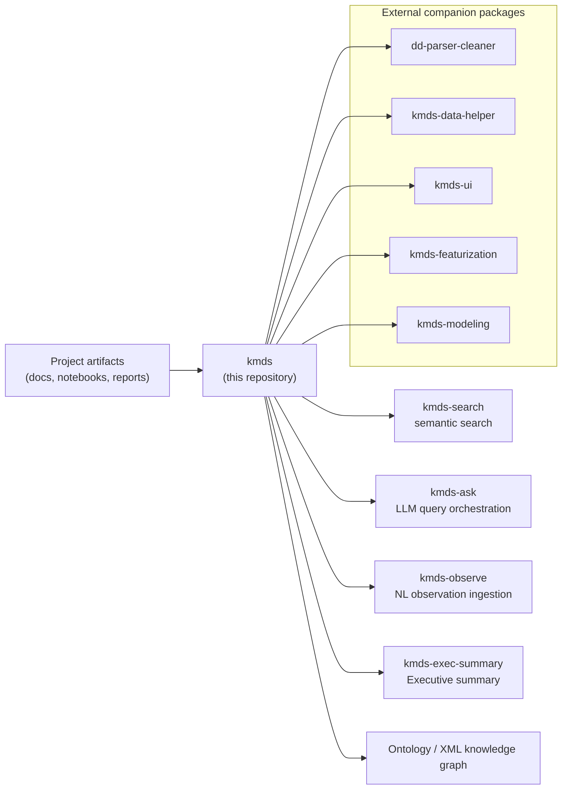

<p align="center">
  <a href="https://kmds.readthedocs.io/en/latest/">
    
  </a>
</p>

<h1 align="center">Knowledge Management for Data Science (KMDS)</h1>

<p align="center">
  <strong>Capture, organize, and reuse knowledge from your data science experiments.</strong>
</p>

<p align="center">
  <a href="https://zenodo.org/doi/10.5281/zenodo.10695270"></a>
  <a href="https://opensource.org/licenses/Apache-2.0"></a>
  <a href="https://kmds.readthedocs.io/en/latest/?badge=latest"></a>
</p>

## KMDS — Knowledge Management for Data Science

> KMDS is a framework for building well-documented analytical and machine learning models for operational data, with LLM-assisted search and summary workflows.

Operational decisions — monthly forecasts, risk assessments, demand plans — need to be trustworthy, explainable, and repeatable. KMDS enforces the discipline that makes that possible, and makes the knowledge generated during development searchable and persistent long after the project ends.

---

## Who This Is For

KMDS is a productivity tool for **mid-level and above data scientists** working in small teams (2–10 people) on operational analytics problems.

It assumes you write design documents, document your modeling decisions, and comment your notebooks. If you do, KMDS makes that work searchable, auditable, and transferable. If you don't, start there first — garbage in, garbage out applies here as much as anywhere.

---

## The Problem It Solves

Small data science teams building operational models face a consistent failure mode: the knowledge generated during development — why a feature was engineered a certain way, why one model was chosen over another, what the data quality issues were and how they were resolved — lives in Slack threads, people's heads, and uncommented notebooks. When team members rotate, when a model needs to be audited, or when a second interface is built on the same domain, that knowledge has to be reconstructed from scratch.

KMDS captures that knowledge as it is generated and makes it queryable in plain English.

---

## Architecture



In practice, `dd-parser-cleaner` is the first companion step for cleaning tabular data and enriching it with metadata; its output is then used by downstream companion packages such as `kmds-featurization` and `kmds-modeling`.

This repository implements the core `kmds` package, which provides:

- CLI entry points for project summary logging, executive summaries, semantic search, search orchestration, and natural-language observation ingestion
- Ontology-backed XML/OWL knowledge graph workflows
- Local semantic indexing using sentence-transformers
- Optional LLM routing via Google GenAI or a custom LLM backend

Broader KMDS ecosystem packages such as `dd-parser-cleaner`, `kmds-data-helper`, `kmds-ui`, `kmds-featurization`, and `kmds-modeling` are companion projects in the wider ecosystem, not part of this repository.

### Components

| Component | Role |
|---|---|
| `kmds` | Core KMDS package in this repository, providing CLI entry points and ontology-backed knowledge graph workflows |
| `dd-parser-cleaner` | External companion package for cleaning and enriching data for featurization and modeling |
| `kmds-data-helper` | External companion package for ingesting documents and notebooks into KMDS |
| `kmds-featurization` | External companion package for structured feature engineering workflows |
| `kmds-modeling` | External companion package for model development and decision capture |
| `kmds-search` | Semantic search capability available through this repo's CLI and search modules |

All knowledge graph operations in this repository are built around the core `kmds` package. External ecosystem packages are noted for context, but they are not included here.

---

## Key Repo Functionality

This repository defines the following CLI entry points in `pyproject.toml`:

- `kmds-summary-log`
- `kmds-exec-summary`
- `kmds-search`
- `kmds-ask`
- `kmds-observe`

The core package also includes ontology loading, semantic index building, and natural-language observation mapping.

---

## Setup

Install the package locally from this repository:

```bash
pip install -e .
```

Or install from PyPI if available:

```bash
pip install kmds
```

To install companion KMDS ecosystem packages from PyPI:

```bash
pip install dd-parser-cleaner kmds-data-helper kmds-ui kmds-featurization kmds-modeling
```

This repository does not include UI workbench or repository-scanning companion packages such as `kmds-ui` or `kmds-data-helper`.

### Optional LLM Support

LLM-assisted search orchestration and executive summary generation require the optional `google-genai` dependency and a valid `GOOGLE_API_KEY` environment variable. The package also supports supplying a custom LLM callable programmatically.

---

## The Blueprint: How a KMDS Project Works

### Responsibilities

A KMDS engagement has three clear areas of responsibility:

**The Client / Domain Owner**
- Provides access to operational data
- Reviews and validates domain analysis documents
- Defines what a trustworthy, auditable result looks like for their business

**The Data Science Team**
- Authors design documents, data dictionaries, and cleaning reports
- Documents modeling decisions and rationale in notebooks
- Maintains the `documents/` directory as a first-class artifact

**The Framework (KMDS)**
- Ingests all documentation into a structured knowledge graph
- Preserves lineage across featurization and modeling phases
- Makes accumulated knowledge queryable and auditable at any point

### The `documents/` Directory

Every KMDS project has a consistent `documents/` structure regardless of domain:

```
project/
├── documents/
│   ├── domain_analysis.md        # Business problem, unit of analysis, success criteria
│   ├── data_dictionary.md        # Schema, field definitions, known quality issues
│   ├── cleaning_report.md        # What was found, what was done, what was deferred
│   ├── feature_engineering.md    # Feature decisions and rationale
│   └── modeling_report.md        # Model selection, validation approach, final rationale
├── notebooks/
└── data/
```

This consistency is intentional. A new team member, an auditor, or a returning developer can orient themselves in any KMDS project without a walkthrough.

---

## Worked Example: SBA Loan Default Prediction

### The Business Problem

The U.S. Small Business Administration (SBA) loan dataset presents a classification problem: given a loan application, predict whether it will default. For a lending operation, this decision needs to be explainable to regulators, auditable after the fact, and reproducible when the model is retrained on new data. A black-box model with no documented rationale is not acceptable.

### How the Project Was Developed

**Phase 1 — Domain Analysis**
The domain analysis document established the unit of analysis (individual loan), the target variable (default/no default), the relevant time horizon, and the business constraints on false positives vs false negatives. The client validated this document before any data work began.

**Phase 2 — Data Quality and Cleaning**
The data dictionary catalogued all fields, their types, missing value rates, and known encoding issues. The cleaning report documented every transformation applied and the rationale — not just what was done, but why, and what alternatives were considered and rejected. `dd-parser-cleaner` was used to apply the boilerplate cleaning methodology for tabular data, enrich records with metadata, and prepare the dataset for downstream featurization and modeling.

**Phase 3 — Featurization**
Feature engineering decisions were captured through the `kmds-featurization` companion component. The workflow explicitly factored in the user’s decision to featurize domain-specific entities such as geographical addresses using custom feature derivations and entity-aware transformations. Each feature includes its derivation logic and the business reasoning that motivated it.

**Phase 4 — Modeling**
Model selection, validation approach, and the final rationale for the chosen model are captured in the modeling report and persisted into the knowledge graph via the external `kmds-modeling` companion component.

**The result:** A complete, queryable record of every decision made during development. Six months later, when a regulator asks why the model treats a particular loan characteristic the way it does, the answer is in the knowledge graph — not in someone's memory.

[→ View the full SBA example](https://github.com/rajivsam/kmds_migration/tree/main/sba_migration)

### What You Can Query After the Fact

Once the knowledge graph is built, the core repository CLI provides several ways to query it:

- `kmds-search --project-file <KB_FILE> --query "..."` for local semantic search
- `kmds-ask --project-file <KB_FILE> --query "..."` for LLM-assisted question routing and synthesis

Example questions:

- "Why was this feature included?"
- "What data quality issues were found in the loan term field?"
- "What models were evaluated and why was logistic regression chosen?"
- "What did the cleaning report say about missing NAICS codes?"

No archaeology through notebooks. No asking the original developer. The knowledge can be recovered from the graph.

---

## Portability Across Domains: The Olist Example

The SBA example is a risk/classification problem in financial services. The [Olist example](https://github.com/rajivsam/kmds_migration/tree/main/olist_migration) applies the identical `documents/` structure and workflow to a retail operational analytics problem — a fundamentally different domain, different data types, different modeling approach.

The `documents/` directory is identical in structure. The process is identical. The knowledge graph captures the same categories of decisions.

This is the point: KMDS is not a solution to one type of problem. It is a discipline for operational data science work that travels across domains because the underlying practice — document your decisions, capture your rationale, make it auditable — is domain-agnostic.

---

## What You Get at the End of a KMDS Project

- A **queryable knowledge graph** of every analytical decision made during development
- A **consistent document set** that any team member or auditor can navigate without a guide
- **Lineage** from raw data through features to model, with rationale at each step
- A **transferable methodology** — the second project in a domain is faster because the first project's knowledge is accessible, not lost

---

## Related Tools

- [tseda](https://github.com/rajivsam/tseda) — automated SSA-based decomposition for regularly sampled time series, with KMDS lineage persistence

---

## License

Apache 2.0

---

## 🤝 Contributing
