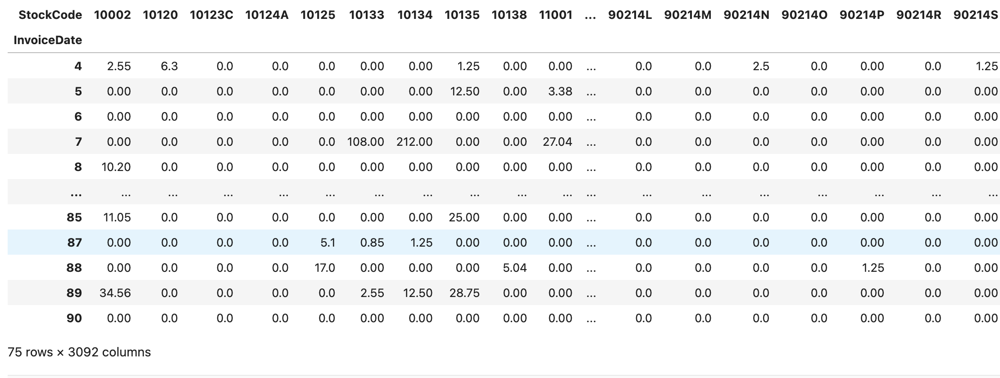

## An Example of Using KMDS in a Machine Learning Use Case

An example of using KMDS in a machine learning use case is illustrated with a real world use case from the retail domain. This is a supplement to implement the [the recipe](../workflow_recipe.md) for a machine learning use case. The data for this use case is a set of transactions at an online retail store based in the UK. The data is available from the [UCI machine learning repository](https://archive.ics.uci.edu/dataset/502/online+retail+ii). The data spans transactions at the store over the years 2010 through 2011. The task description for this use case is given below.

### Task Description

Let's set the date for this exercise to be the first week after the business quarter in the year 2010. The store management would like to understand the shopping preferences of customers who shopped at the store in the first quarter. They have not done developed a model like this before. They would like to approach the model development guided by principled experiments to understand the characteristics of the data. This phase will be modelled with the Knowledge Extraction Experiment Workflow. This sketch illustrates how KMDS can be used to log data from an experimental workflow.

## Data Processing Approach

1. The raw data set covers the period 2010 and 2011. We only need the first quarter data for this analysis. So we subset the data corresponding to this period. This [notebook](/examples_of_use/machine_learning/example_ml_data_subsetting.ipynb) has the code for doing this. The original dataset can be obtained from the [UCI machine learning repository](https://archive.ics.uci.edu/dataset/502/online+retail+ii)
2. The modelling approach is illustrated on the data for Q1 2010. The data for Q2 2010 is also provided and can be used to evaluate or replicate the approach on a new dataset. This is the analysis that would be performed by the data science team at the end of the second quarter. For those interested in exploring this tool, replicating the analysis for the first quarter on the data from the second quarter may be a good way to gain familiarity with the tool.

## Exploratory Data Analysis

Exploratory Data Analysis performs the following tasks:

1. It identifies the issues in the raw data set that prevent us from developing an understanding of the raw data, for example, we can have mixed types in raw data set. A price could have a string value. This prevents us from using basic statistical tools to analyze the data. Such issues are called _attribute noise_ in the notebooks.
2. It removes _attribute noise_
3. Given our task description, we evaluate transformations of the raw data that can help us achieve the task goal. Since our goal is to understand customer behavior in the first quarter. We could compute the sales of each of the store inventory items for each day of the first quarter (there are 75 business days in the first quarter). We could then analyze this sales per day representation from a similarity view point and evaluate if we can find patterns of daily purchases at the store during the first quarter.  In other words, we _explore_ ways to develop _data representations_ that can help us achieve our task goals.
4. Details of the issues identified and the processing steps to resolve them are captured as _knowledge_ and logged.
5. Details describing the approaches that are evaluated to develop _data representations_ that can help us with the analysis task are logged.
6. See [this notebook](/examples_of_use/machine_learning/example_ml_eda_phase.ipynb) for the implementation.

## Data Representation

1. In the raw dataset, each line represents a line item in a sales transaction that occured in the store. If you went to the online store and purchased five types of items, then your purchase (transaction) would generate one line in the dataset for each of the five item types, so your purchase would generate five lines. This information for the first quarter of 2010 is the _raw data representation_. A sample is shown in the image below.

2. As discussed in the exploratory data section, compute a representation where we aggregate all the sales transactions per day and then represent the daily sales for the quarter as a vector that has length equal to the size of the inventory. An element of the vector represents the daily sales corresponding to the inventory item coordinate. A sample of this representation is shown below. This representation is called the _daily sales representation_ in this discussion.

As part of capturing knowledge about data representations, the above two statmements are logged. See [this notebook](/examples_of_use/machine_learning/example_ml_data_rep_phase.ipynb) for the implementation.

## Modelling

There are two sub-stages in modelling:

### Modelling Choices:

In this phase you explore and evaluate indirect modelling choices related to developing a model that accomplishes the task goal. Some examples of indirect modelling choices:

1. Feature Engineering choices - for example do you want to use PCA or an auto-encoder to develop a new representation for your modelling task.
2. Hyper-parameter choices in support of specific modelling choices. For example, do you want to use a specific kernel for your kernel learning method. Do you want to use a specific decision tree height parameter
   Note that these choices can be informed by other knowledge extraction experiments. These knowledge extraction experiments have the explicit goal of informing the model selection approaches used in this pipeline.

For this example, the modelling choices are as follows. The _daily sales representaion_ , as computed initially is high dimensional. A review of the bottom left corner of the above figure shows that there are 3092 items in the inventory. A review of the contribution of each inventory item to the quaterly sales revenue exhibits a power law type curve. Over two thirds of the inventory items do not contribute to the revenue generated from sales in the first quarter. We remove these items from the daily sales representation. This is a modelling choice that simplifies the problem we are trying to model - that of characterizing the shopping activity of the shoppers at the store succintly and extracting patterns of shopping behavior from it.  After removing these rendundant items from the daily sales representation we have a much smaller daily representation. We then apply Principal Component Analysis to reveal a small set of store inventory items that can account for most of the shopping activity in the store during the first quarter of 2010. See [this notebook](/examples_of_use/machine_learning/example_ml_modelling_phase_mc.ipynb) for details of the implementation.

### Model Selection

In this phase you explore the modelling approaches you want to evaluate towards accomplishing your task goal. As discussed in the previous paragraph, we will use Principal Components Analysis for this purpose. There are multiple techniques to summarize datasets. The choice of the approach depends on the application and practical considerations such as schedule and cost. In this work, we are establishing a baseline, so we use a standard technique. The observations we make during modelling are noted and logged using the api. See [this notebook](/examples_of_use/machine_learning/example_ml_modelling_phase_ms.ipynb) for details of the implementation.

## Retrieving Logged Information

Information logged durring analysis tasks can be retrieved using the API, see [this notebook](/examples_of_use/machine_learning/example_ml_observations_report.ipynb) for how this is done for the provided example.
