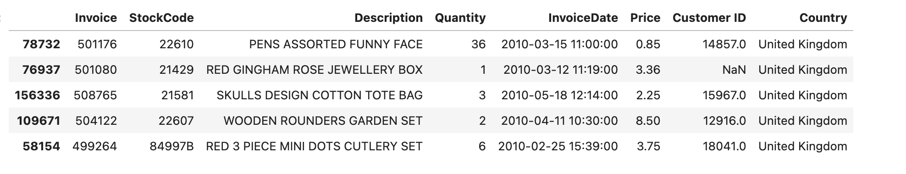

## An Example of Using KMDS in a Machine Learning Use Case

An example of using KMDS in a machine learning use case is illustrated with a real world use case from the retail domain. The data for this use case is a set of transactions at an online retail store based in the UK. The data is available from the [UCI machine learning repository](https://archive.ics.uci.edu/dataset/502/online+retail+ii). The data spans transactions at the store over the years 2010 through 2011. The task description for this use case is given below.

### Task Description

Let's set the date for this exercise to be the first week after the business quarter in the year 2010. The store management would like to understand the shopping preferences of customers who shopped at the store in the first quarter. They have not done developed a model like this before. They would like to approach the model development in two phases. The first phase is an exploratory phase. In this phase a suitable modelling approach is determined through principled experimentation. The second phase is an implementation of the modelling approach determined optimal in the first phase.

The first phase will be modelled with the Knowledge Extraction Experiment Workflow. The second phase that implements the optimal model will be implemented with the Knowledge Application Workflow. The second phase workflow is informed by the first workflow.

The deployed model is used for sometime, for example, till the end of the second quarter of 2010. Then the data science team will use the Knowledge Extraction Experiment Workflow using the same approach as the one documented in the experimental workflow for the first quarter. Since the information about the modelling approach has been logged, they can easily look it up and see what needs to done. They repeat this process and observe the results. If it is satisfactory, they may use the exact sample modelling approach used in the first quarter, otherwise, they will conduct new modelling experiments to address the deficiencies observed. The optimal model is then developed using an Knowledge Application Workflow. Knowledge application workflows can be implemented as pipelines that can be used by MLOps teams for deployment.

## Data Processing Approach

1. The raw data set covers the period 2010 and 2011. We only need the first quarter data for this analysis. So we subset the data corresponding to this period. This [notebook](/examples_of_use/machine_learning/retail_scope_raw_dataset_to_2010_Q1_Q2.ipynb) has the code for doing this. The original dataset can be obtained from the [UCI machine learning repository](https://archive.ics.uci.edu/dataset/502/online+retail+ii)
2. The modelling approach is illustrated on the data for Q1 2010. The data for Q2 2010 is also provided and can be used to evaluate or replicate the approach.

## Data Representation

In the raw dataset, each line represents a line item in a sales transaction that occured in the store. If you went to the online store and purchased five types of items, then your purchase (transaction) would generate one line in the dataset for each of the five item types, so your purchase would generate five lines. This information for the first quarter of 2010 is the _raw data representation_. A sample is shown in the image below.

## Modelling

## Knowledge Capture
