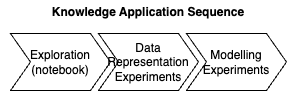

# The Knowledge Management Application Workflow

## Choose Your Workflow Type

Pick a workflow for your task. The following types of workflow are available:

1. Scenario A: Application Based Pipeline
   In this scenario, the computational approach to develop the model (for an analytics application) or the learning approach (for a machine learning model) is considered an established fact. There is limited experimental evaluation in the workflow stages. These experiments are primarily intended to work through the variations in the workflow introduced by the data you receive. For example, the input data sources may have sources of error you have not seen before. Model parameters are estimated from the data, so new data implies that the parameters need to be re-estimated. You may want to use this workflow for analytic tasks where you are performing computation on the data, for example, if your analytics use case computes shortest paths, but the network data keeps changing for each time period, then you would use this workflow. You may also want to use this workflow for machine learning tasks where the algorithmic approach is fixed, for example, you have decided to use XGBoost or AutoGluon, however, you need data specific customizations for each run of the workflow.
2. Scenario B: Experiment Based Pipeline
   In this scenario the computational approach or the modelling approach is not established. A sequence of experiments are needed to establish a suitable approach. Experimental approaches go towards informing Scenario A pipelines. This would be the scenario you use in a project where you are going through a design phase where you are going to evaluate different design choices and then make a determination of the final modelling approach based on the experimental results observed.

   ## Perform the Activities in the Workflow

   Both workflows consists of the stages shown in the schematic below

   

The activities for each stage can be done in Jupyter notebooks on a compute cluster. The salient aspects of each phase are as follows:

1. Exploration: The input to exploration phase is the raw data that is deemed relevant to the use case by a domain expert, for example a data or business analyst, or perhaps a product manager. During exploration, the relevance of the input data to modelling task is established. Data quality is assessed. A subset of the input data that is deemed to be relevant and of sufficient quality is used for further analysis.
2. Data Representation Experiments: The raw data that is relevant and of sufficient quality is not in a form that can be used to develop models. Additional processing to transform the raw data to a representation that is suitable for modelling is required. Developing these representations often requires experimentation. Several candidate representations may need to be evaiuated to determine a representation that is suitable.
3. Modelling Experiments: When suitable data representations are determined, data scientists develop models on these representations. The basic difference between the application based pipeline and the experiment pipeline is in the extent of the data representation and the modelling experiment stages. Experimental pipelines are used to evaluate candidate representations and models for use in the final application pipeline.

## Guidelines for capturing facts that must be logged

1. In genral, all decisions that change input data or data representations need to be logged with documentation that makes it possible to reproduce these changes. In other words, it is possible for data scientists to reproduce the intermediate data artifacts from the input data by following the logged documentation.
2. The rationale for making modelling choices and the experimental pipelines that informed the rationale should be clearly logged with documentation.
3. Methodology to evaluate task performance must be logged.
4. Assumptions for modelling must be logged.

A knowledge management tool for data science should make the above possible. This package is a step in this direction.
