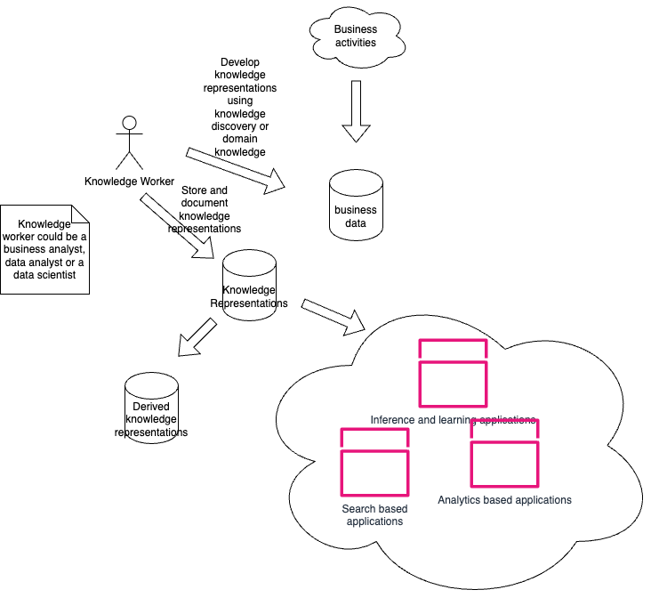

## Knowledge Management in Data Science

*Data Science and Knowledge Creation*

### The Knowledge Management Context

The schematic above illustrates the process of curating knowledge and developing knowledge representations in a typical enterprise setting. Viewed as a process, the raw material for knowledge creation is business data from operations. Knowledge discovery (tools from data mining) and knowledge elicited from domain experts is used to develop knowledge representations. These representations are typically created by data analysts and or business analyts that have a good understanding the business problem for which a software solution is being developed. These representations are then used by data scientists to develop:

* Data Analytic applications
* Machine Learning applications
* Search Applications

These representations can also be used develop derived representations.

## The Exploratory Nature of Knowledge Creation and Curation

This process of developing knowledge representations iterative and experimental. A data analyst or business analyst rarely has an epiphany that reveals the best knowledge representations for a particular use case. There is a lot of experimental evaluation to determine the best representation. A data scientist developing models using these representations can derive new representations that may help his/her models perform better.

## The Evolutionary Nature of Knowledge Creation and Curation

Knowledge related to a use case and the representations associated with it may evolve with time. This can happen because business analysts understand the nuances of the business process as they see more data . Similarly, data scientists, may develop a better understanding of the process they are trying to model as they see more data.

## The Knowledge Graph Solution

Graph based approaches have a long history in AI. They have been used with success in domain modelling for a while. A lot of the reasons and motivations for using them in domain models prevail in implementation models too. An integrated approach that links domain and data science models will facilitate model development and evaluation. Most importantly, it permits linking the data science model performance to business performance measures and provides a common context for domain analysts to discuss solution characteristics with the data scientists.
